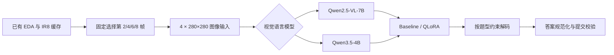

# CUHK-X Large Model Track：隐私保护视频多模态问答

面向 [CUHK-X Competition Large Model Track](https://www.kaggle.com/competitions/cuhk-x-competition-large-model-track) 的端到端方案。项目复用已完成的红外视频抽帧缓存，完成视觉语言模型推理、受约束答案生成、模型对照和 QLoRA 后训练。

> An end-to-end multimodal VQA solution for privacy-preserving human activity understanding, with deterministic frame selection, constrained decoding, model comparison, and QLoRA post-training.

## 项目结果

### 任务效果

| 方案 | Kaggle 最终分数 | 相对对应 baseline 的变化 |
|---|---:|---:|
| Qwen2.5-VL-7B baseline | 0.41764 | — |
| Qwen2.5-VL-7B QLoRA | 0.42058 | +0.00294 |
| Qwen3.5-4B baseline | 0.44411 | — |
| **Qwen3.5-4B QLoRA** | **0.54705** | **+0.10294** |

Qwen3.5-4B QLoRA 在固定开发集上也由 `0.44667` 提升至 `0.54133`。Kaggle 分数来自 2026-09-17 的提交记录；开发集和竞赛测试集采用不同数据划分，不直接混用，也不据此声明竞赛排名。

### 推理执行：Qwen3.5-4B baseline，2×T4

为了让最终选定的 Qwen3.5-4B 不只停留在“模型效果更好”，我又在相同的 2×T4 工作负载下比较了 vLLM 的 TP、DP 和请求批处理配置。下面测的是 **Qwen3.5-4B base model，不包含 QLoRA adapter**；QLoRA adapter serving 尚未进行同口径测试。

| 历史配置 | Runner 批次 / 每 replica `max_num_seqs` | 推理吞吐 | 模型加载 / 682 条端到端耗时 | 运行结束空闲显存 / GPU |
|---|---:|---:|---:|---:|
| TP2 | 1 / 1 | 1.167 req/s | 82.8 s / 675.0 s | 3.66 GiB |
| TP2-B32 | 32 / 32 | 1.430 req/s | 83.2 s / **567.8 s** | 1.29 GiB |
| DP2-B16（历史实测） | 16 / 16 | **1.549 req/s** | 182.5 s / 630.4 s | 3.14 / 3.03 GiB |

历史 DP2-B16 的推理阶段吞吐比 TP2-B32 高 8.3%，但当时模型加载是串行的，因此端到端耗时多 62.6 秒。表中 DP2-B16 的 Runner 总批次是 16，每个 replica 的 `max_num_seqs` 也是 16。

当前 test Notebook 使用 DP2、每个 replica 的 `max_num_seqs=16`、Runner 全局 batch=32；两个 replica 先同时启动，再等待模型加载。B32 配置尚未在 Kaggle 测量，不能沿用历史 B16 的吞吐或耗时。完整口径和限制见 [Qwen3.5-4B vLLM 双卡推理实验](docs/qwen35_vllm_serving.md)。

## 竞赛任务

模型回答隐私保护短视频中的多项选择题，涵盖动作识别、动作组合、时序关系、情绪和物体交互。测试集来自训练阶段未出现的受试者，要求系统固定输入协议、支持单选/多选/有序答案，并在云端 GPU 上完成可恢复评估。

## 方法概览



项目保留每个视频均匀抽取的 8 帧、448×448 IR JPEG 缓存，模型读取零起始索引 `[1, 3, 5, 7]`，即第 2/4/6/8 帧。原始视频体积较大，当前流程不重新执行 EDA 或抽帧。

训练数据使用固定的 subject-grouped 五折划分：

| 用途 | 数据 | QA 数量 |
|---|---|---:|
| QLoRA 训练 | fold 0–2 | 2,593 |
| 开发集选择 | fold 3 | 750 |
| 固定确认 | fold 4 去除 pilot | 624 |
| 历史诊断 | pilot | 120 |

## 工程实现

- **确定性输入协议**：固定选帧、图像尺寸、prompt 版本和答案解析规则，保证模型对比只改变目标变量。
- **防数据泄漏门禁**：使用 subject-grouped folds，先在 dev 选择候选，再运行 confirm；确认后才生成 test submission。
- **QLoRA 后训练与 adapter 验证**：检查 adapter 来源、目标层、权重更新、基础模型 revision 和来源收据。
- **vLLM 双卡推理**：Qwen3.5-4B 的 adapter 重载、dev/confirm 评估与 test 推理使用 vLLM 0.19.1；训练仍走 Transformers。运行合同记录 `engine` 和执行配置，避免不同路径的结果混用同一 run-id。
- **可恢复执行**：推理和训练保存 contract、checkpoint、数据签名与环境信息，支持安全 `--resume`。
- **多模型 / 多引擎隔离**：Qwen2.5-VL-7B 与 Qwen3.5-4B 使用独立配置、依赖锁、Notebook、权重校验和运行目录。
- **可移植云端包**：训练 ZIP 内置完整五折 IR8 缓存；打包时验证清单、文件哈希、大小与图片解码，依赖安装使用哈希锁。
- **无 GPU 本地检查**：本地只运行 CPU 数据、契约和语法校验，不重新处理原始视频。

## 可复现入口

| 实验线 | Kaggle Notebook | 云端包 |
|---|---|---|
| Qwen2.5-VL-7B baseline | [`cuhk-x-base7b.ipynb`](notebooks/cuhk-x-base7b.ipynb) | `artifacts/cloud/ir4_7b_v1.zip` |
| Qwen2.5-VL-7B QLoRA | [`cuhk-x-qlora-full-v3.ipynb`](notebooks/cuhk-x-qlora-full-v3.ipynb) | `artifacts/cloud_training/cuhkx-ir4-qlora-full-v3.zip` |
| Qwen3.5-4B baseline | [`qwen35-4b-vllm.ipynb`](notebooks/qwen35-4b-vllm.ipynb) | `artifacts/cloud/qwen35_4b.zip` |
| Qwen3.5-4B QLoRA | [`qwen35-4b-qlora-vllm.ipynb`](notebooks/qwen35-4b-qlora-vllm.ipynb) | `artifacts/cloud_training/qwen35_4b_qlora.zip` |

模型权重不提交到 Git。Notebook 可以下载固定 revision，或读取带来源收据的私有 Kaggle Input。ZIP 不提交到 Git，需由维护者通过 Kaggle Input 等渠道另行提供。

运行预制包时，必须把与该 ZIP 对应的可信 `manifest_sha256` 填入 Notebook 的 `EXPECTED_MANIFEST_SHA256`；不要从 ZIP 自身读取期望值。自行打包时，运行对应脚本并复制终端输出的 `manifest_sha256`。

## 本地校验

本地环境要求 Python 3.11；不需要 GPU，也不会重新处理原始视频。

```powershell
python -m pip install --require-hashes -r requirements/cpu.lock.txt
python -m pip install --no-deps --no-build-isolation -e .

cuhkx check --dataset test
cuhkx check --dataset pilot
cuhkx training-check --profile qwen35 --training-config configs/training_qwen35.yaml
python scripts/test.py -q
```

真实模型推理与 QLoRA 训练需要 Kaggle CUDA GPU，具体步骤以对应 Notebook 为准。

## 项目结构

```text
configs/                  固定模型、数据、提交和训练协议
data/                     QA、fold 映射、IR8 缓存与资产清单
notebooks/                四条 Kaggle 推理/训练入口
src/cuhkx/                数据校验、推理、训练、评测和提交逻辑
scripts/                  Notebook 生成、云端打包和测试入口
artifacts/cloud/          baseline 云端包（Git 忽略 ZIP）
artifacts/cloud_training/ QLoRA 云端包（Git 忽略 ZIP）
docs/                     数据来源、复现说明和 debugging 记录
tests/                    不污染工作区的 CPU 回归测试
```

## 文档

- [数据与缓存来源](docs/data_provenance.md)
- [云端 baseline 运行](docs/cloud.md)
- [QLoRA 后训练设计](docs/post_training.md)
- [完整训练包说明](docs/training_release.md)
- [Qwen3.5-4B 模型对照](docs/qwen35_4b.md)
- [Qwen3.5-4B QLoRA 后训练](docs/qwen35_training.md)
- [Qwen3.5-4B vLLM 双卡推理实验](docs/qwen35_vllm_serving.md)
- [Qwen3.5 Kaggle debugging 记录](docs/qwen35_debugging.md)

## 限制与说明

- 仓库复用已完成的 EDA 和抽帧结果，不包含重新处理原始视频的主流程。
- 本地环境无 GPU；GPU 推理和训练结果来自 Kaggle 云端运行。
- 批处理 run 未记录单请求尾延迟分位、GPU 利用率、功耗或账单成本；README 表格中的显存是运行结束时的空闲量，不是峰值。
- 模型权重、竞赛原始数据和生成的 ZIP 不纳入 Git，使用时需遵守各自许可证与竞赛规则。
- test 标签不在本地；本地校验能证明提交完整、格式正确，不能替代 Kaggle accuracy 或 leaderboard 分数。

## Competition

- [CUHK-X Competition Large Model Track — Kaggle](https://www.kaggle.com/competitions/cuhk-x-competition-large-model-track)
- [CUHK-X Competition — UbiComp/ISWC 2026](https://www.ubicomp.org/ubicomp-iswc-2026/cuhk-x-competition/)
