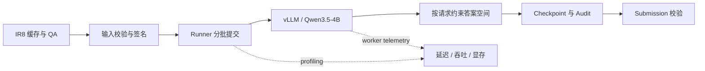

# Qwen3.5-4B Inference Infrastructure for Multimodal VQA

面向 **AI Infra / Inference Engineering** 的工程项目。以隐私保护视频问答为工作负载，在 Kaggle 双 T4 上构建并测量 Qwen3.5-4B 推理链路，重点处理 vLLM 请求批处理、TP/DP 配置对比、运行时指标采集、输出约束和可恢复交付。

> Built a measurable and recoverable multimodal inference workflow: vLLM serving, request batching, parallelism experiments, process-aware GPU telemetry, constrained outputs, and integrity-checked releases.

项目关注“服务如何运行、性能如何测量、结果如何复现”。竞赛任务为应用场景；模型准确率与推理系统指标分开报告。

## 工程摘要

| 方向 | 项目内容 |
|---|---|
| Serving | Qwen3.5-4B、vLLM 0.19.1、双 T4；当前代码路径为 TP=2，另有 DP=2 实测对照 |
| Scheduling | [`runner.py`](src/cuhkx/inference/runner.py) 按 `max_num_seqs` 分批；[`qwen35_vllm.py`](src/cuhkx/inference/qwen35_vllm.py) 为每条请求应用独立答案约束 |
| Observability | [`profiling.py`](src/cuhkx/inference/profiling.py) 与 [`bench_report.py`](scripts/bench_report.py) 汇总加载、延迟、吞吐、token rate 和显存 |
| Reliability | 固定模型 revision、输入签名、运行合同与 checkpoint；校验提交格式及完整性 |
| Delivery | 哈希锁定依赖，使用清单摘要和有界解包验证云端包来源与内容 |

## 工作负载与请求链路

CUHK-X Large Model Track 的输入是隐私保护红外视频多项选择题。原始视频处理已完成；本项目复用 IR8 缓存，每题选择零起始索引 `[1, 3, 5, 7]`（第 2/4/6/8 帧），缩放为 4 × 280×280 输入。test 工作负载包含 682 条请求，覆盖 single、multi、combination、sequence、object interaction 和 emotion 六类题型。



QLoRA 后训练仍保留在项目中，训练、dev 选择与 confirm/test 门禁使用固定的 subject-grouped 五折数据：train 2,593 QA、dev 750 QA、confirm 624 QA；这部分作为推理工作负载的上游模型生命周期，不作为本 README 的主要叙事。

## AI Infra 工程实现

- **批处理与并行策略**：当前仓库实现 vLLM TP=2 推理，并以 `max_num_seqs` 调整请求批次；请求结束后输出实际批次大小和吞吐。V3 还测量了 DP=2、TP=1、`max_num_seqs=16`，具体结果见下表。
- **请求级结构化输出**：为 batch 中每条请求分别构造 `SamplingParams`，使单选和有序多选使用各自答案空间；避免共享约束造成越界答案或错误 grammar。
- **进程感知的指标采集**：分别记录模型加载、image/generation/overhead 阶段、请求延迟分位、TTFT、token rate、batch 吞吐和逐卡显存。vLLM worker 在子进程运行，worker 指标通过引擎 RPC 采样，避免把父进程的零显存读数误当作真实用量。
- **可恢复运行**：记录 engine、模型 revision、输入签名、配置合同和 checkpoint；`--resume` 只接受签名一致的运行，避免不同引擎或数据源混用同一 run-id。
- **输出与发布校验**：验证每个 test ID 恰好对应一条规范答案；云端 ZIP 用文件清单、哈希、包大小和路径检查，依赖安装使用哈希锁。
- **模型生命周期门禁**：保留 QLoRA 训练与 dev/confirm/test 流程，检查 adapter 来源、目标层、权重更新和模型 revision。

## vLLM 性能实测

以下 run 使用相同的 Qwen3.5-4B revision、682 条 test 请求和双 T4。TP 批处理与 DP 实验使用相同的输入签名和 vLLM 软件版本；Transformers 行作为跨引擎参考。表中“推理阶段吞吐”排除模型加载；“端到端耗时”包含模型加载。批处理 run 的单请求耗时是整批时间摊到每条请求，不代表单请求 P95。

| Run | Serving 配置 | 加载时间 | 推理阶段吞吐 | 推理阶段耗时 | 端到端耗时 | 结束时每卡剩余显存 |
|---|---|---:|---:|---:|---:|---:|
| Transformers baseline | `device_map`，batch 1 | 7.6 s | 未记录 | 未记录 | 768.6 s（0.887 req/s） | 未记录 |
| vLLM TP 单请求 | TP=2 | 82.8 s | 1.167 req/s | 均值 856.8 ms；P95 1010.2 ms | 675.0 s（1.010 req/s） | 3.66 GiB / 卡 |
| vLLM TP 批处理 | TP=2，`max_num_seqs=32` | 83.2 s | 1.430 req/s | 摊销 699.2 ms / 请求 | **567.8 s（1.201 req/s）** | 1.29 GiB / 卡 |
| vLLM DP 实验 | DP=2、TP=1，`max_num_seqs=16` | 182.5 s | **1.549 req/s** | **摊销 645.6 ms / 请求** | 630.4 s（1.082 req/s） | 3.14 / 3.03 GiB |

TP 批处理与 DP 实验的推理阶段数据分别来自 22 个、43 个 batch；平均实际 batch 大小为 31.0 和 15.86。DP 实验相较 TP 批处理吞吐提高 **8.3%**，摊销耗时降低 **7.7%**，推理阶段节省约 **36.5 秒**；但模型加载多约 **99.3 秒**，因此这次单次 682 请求的端到端时间反而多 **62.6 秒**。按双卡全程占用估算，启动加推理约为 TP 批处理 **1665**、DP 实验 **1849 GPU 卡秒 / 千请求**。DP 结束时每卡多保留约 **1.75–1.85 GiB** 显存。

**复现范围说明：** DP=2 / `max_num_seqs=16` 的 V3 是另一工作区生成的 Kaggle 实测；本地 `outputs/qwen35_4b_test/qwen35_4b_test_vllm_v3/resolved_config.json` 记录了实际配置，但对应实现尚未同步进当前 Git commit。当前 checkout 可复现 TP=2 / `max_num_seqs=32` 路径。DP 指标是已测量的实验结果，暂不能声称可由当前 checkout 直接复现。

TP 批处理与 DP 实验有 **675/682（98.97%）** 预测一致，7 条不同；两者的提交文件都通过 682 行格式校验。test 标签不在本地，因此不能从这些输出判断哪种配置准确率更高。批处理 run 未记录可比的 P95；GPU 利用率和功耗也未采集。显存列是运行后的设备快照，不是峰值。

汇总本机已保存的 run（只读 `outputs/`，不启动模型、不写报告文件）：

```powershell
python scripts/bench_report.py
python scripts/bench_report.py --baseline qwen35_4b_test
```

## 可复现入口

| 实验线 | Kaggle Notebook | 云端包 |
|---|---|---|
| Qwen2.5-VL-7B baseline | [`cuhk-x-base7b.ipynb`](notebooks/cuhk-x-base7b.ipynb) | `artifacts/cloud/ir4_7b_v1.zip` |
| Qwen2.5-VL-7B QLoRA | [`cuhk-x-qlora-full-v3.ipynb`](notebooks/cuhk-x-qlora-full-v3.ipynb) | `artifacts/cloud_training/cuhkx-ir4-qlora-full-v3.zip` |
| Qwen3.5-4B baseline | [`qwen35-4b-vllm.ipynb`](notebooks/qwen35-4b-vllm.ipynb) | `artifacts/cloud/qwen35_4b.zip` |
| Qwen3.5-4B QLoRA | [`qwen35-4b-qlora-vllm.ipynb`](notebooks/qwen35-4b-qlora-vllm.ipynb) | `artifacts/cloud_training/qwen35_4b_qlora.zip` |

模型权重不提交到 Git。Notebook 可以下载固定 revision，或读取带来源收据的私有 Kaggle Input。ZIP 不提交到 Git，需由维护者通过 Kaggle Input 等渠道另行提供。

运行预制包时，必须把与该 ZIP 对应的可信 `manifest_sha256` 填入 Notebook 的 `EXPECTED_MANIFEST_SHA256`；不要从 ZIP 自身读取期望值。自行打包时，运行对应脚本并复制终端输出的 `manifest_sha256`。

## 本地校验

本地环境要求 Python 3.11；不需要 GPU，也不会重新处理原始视频。

```powershell
python -m pip install --require-hashes -r requirements/cpu.lock.txt
python -m pip install --no-deps --no-build-isolation -e .

cuhkx check --dataset test
cuhkx check --dataset pilot
cuhkx training-check --profile qwen35 --training-config configs/training_qwen35.yaml
python scripts/test.py -q
```

真实模型推理与 QLoRA 训练需要 Kaggle CUDA GPU，具体步骤以对应 Notebook 为准。

## 项目结构

```text
configs/                  固定模型、数据、提交和训练协议
data/                     QA、fold 映射、IR8 缓存与资产清单
notebooks/                四条 Kaggle 推理/训练入口
src/cuhkx/                数据校验、推理、训练、评测和提交逻辑
scripts/                  Notebook 生成、云端打包和测试入口
artifacts/cloud/          baseline 云端包（Git 忽略 ZIP）
artifacts/cloud_training/ QLoRA 云端包（Git 忽略 ZIP）
docs/                     数据来源、复现说明和 debugging 记录
tests/                    不污染工作区的 CPU 回归测试
```

## 文档

- [数据与缓存来源](docs/data_provenance.md)
- [云端 baseline 运行](docs/cloud.md)
- [QLoRA 后训练设计](docs/post_training.md)
- [完整训练包说明](docs/training_release.md)
- [Qwen3.5-4B 对照](docs/qwen35_4b.md)
- [Qwen3.5-4B vLLM 双卡后训练](docs/qwen35_training.md)
- [Qwen3.5 Kaggle debugging 记录](docs/qwen35_debugging.md)

## 限制与说明

- 仓库复用已完成的 EDA 和抽帧结果，不包含重新处理原始视频的主流程。
- 本地环境无 GPU；GPU 推理和训练结果来自 Kaggle 云端运行。
- 批处理 run 没有可比较的 P95，也没有 GPU 利用率、功耗或成本采样；显存数据是运行前后设备快照。
- 模型权重、竞赛原始数据和生成的 ZIP 不纳入 Git，使用时需遵守各自许可证与竞赛规则。
- test 标签不在本地；本地校验能证明提交完整、格式正确，不能替代 Kaggle accuracy 或 leaderboard 分数。

## 竞赛效果背景

推理基础设施运行的是多模态问答工作负载。最终 Kaggle 提交结果如下；这些分数说明任务效果，不是 serving 吞吐指标。

| 模型与方案 | Kaggle 分数 |
|---|---:|
| Qwen2.5-VL-7B baseline | 0.41764 |
| Qwen2.5-VL-7B QLoRA | 0.42058 |
| Qwen3.5-4B baseline | 0.44411 |
| Qwen3.5-4B QLoRA | **0.54705** |

分数来自 2026-09-17 的最终提交记录；不据此声明竞赛排名。

## Competition

- [CUHK-X Competition Large Model Track — Kaggle](https://www.kaggle.com/competitions/cuhk-x-competition-large-model-track)
- [CUHK-X Competition — UbiComp/ISWC 2026](https://www.ubicomp.org/ubicomp-iswc-2026/cuhk-x-competition/)
