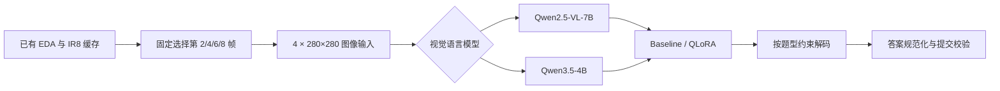

# CUHK-X Large Model Track：隐私保护视频多模态问答

面向 [CUHK-X Competition Large Model Track](https://www.kaggle.com/competitions/cuhk-x-competition-large-model-track) 的端到端可复现方案。项目使用红外视频的固定抽帧缓存，完成视觉语言模型推理、受约束答案生成、模型对照和 QLoRA 后训练。

> An end-to-end, reproducible multimodal VQA pipeline for privacy-preserving human activity understanding, covering deterministic frame selection, constrained decoding, model comparison, and QLoRA post-training.

## 项目结果

| 方案 | Kaggle 最终分数 | 相对对应 baseline 的变化 |
|---|---:|---:|
| Qwen2.5-VL-7B baseline | 0.41764 | — |
| Qwen2.5-VL-7B QLoRA | 0.42058 | +0.00294 |
| Qwen3.5-4B baseline | 0.44411 | — |
| **Qwen3.5-4B QLoRA** | **0.54705** | **+0.10294** |

最佳方案相对最初的 Qwen2.5-VL-7B baseline 提升 **0.12941**。Qwen3.5-4B QLoRA 在固定开发集上也由 `0.44667` 提升至 `0.54133`。

以上 Kaggle 分数来自最终提交记录（2026-09-17），未声明竞赛排名。开发集分数与 Kaggle 分数采用不同数据划分，不直接混用。

## 竞赛任务

竞赛要求模型回答隐私保护短视频中的多项选择题，涵盖动作识别、动作组合、时序关系、情绪和物体交互。测试集来自训练阶段未出现的受试者，因此核心难点包括：

- 从非 RGB 视频中提取稳定的时序视觉信息；
- 泛化到未见过的受试者；
- 同时支持单选、多选集合和有序答案；
- 在云端 GPU 环境中稳定复现推理和后训练结果。

## 方法概览



项目保留每个视频均匀抽取的 8 帧、448×448 IR JPEG 缓存，模型实际读取零起始索引 `[1, 3, 5, 7]`，即第 2、4、6、8 帧。原始视频体积较大，因此重构后的流程不重新执行 EDA 或抽帧。

训练数据采用固定的 subject-grouped 五折划分：

| 用途 | 数据 | QA 数量 |
|---|---|---:|
| QLoRA 训练 | fold 0–2 | 2,593 |
| 开发集选择 | fold 3 | 750 |
| 固定确认 | fold 4 去除 pilot | 624 |
| 历史诊断 | pilot | 120 |

## 工程实现

- **确定性输入协议**：固定选帧、图像尺寸、prompt 版本和答案解析规则，保证模型对比只改变目标变量。
- **多模型隔离**：Qwen2.5-VL-7B 与 Qwen3.5-4B 使用独立配置、依赖锁、Notebook、权重校验和运行目录。
- **可恢复执行**：推理和训练保存 contract、checkpoint、数据签名与环境信息，支持安全 `--resume`。
- **严格 adapter 验证**：检查 LoRA target、基础模型 revision、权重有限性、非零更新和来源收据。
- **防数据泄漏门禁**：先在 dev 选择候选，再运行 confirm；只有 confirm 提升后才生成 test submission。
- **可移植云端包**：训练 ZIP 内置完整五折 IR8 缓存，不依赖原始视频；打包时验证文件清单、哈希和图片解码。
- **无 GPU 本地检查**：本地只执行 CPU 数据与契约测试，不产生 `reports/`、`docs/` 或 `outputs/` 临时结果。

## 可复现入口

| 实验线 | Kaggle Notebook | 云端包 |
|---|---|---|
| Qwen2.5-VL-7B baseline | [`cuhk-x-base7b.ipynb`](notebooks/cuhk-x-base7b.ipynb) | `artifacts/cloud/ir4_7b_v1.zip` |
| Qwen2.5-VL-7B QLoRA | [`cuhk-x-qlora-full-v3.ipynb`](notebooks/cuhk-x-qlora-full-v3.ipynb) | `artifacts/cloud_training/cuhkx-ir4-qlora-full-v3.zip` |
| Qwen3.5-4B baseline | [`qwen35-4b-test.ipynb`](notebooks/qwen35-4b-test.ipynb) | `artifacts/cloud/qwen35_4b_test_v1.zip` |
| Qwen3.5-4B QLoRA | [`qwen35-4b-qlora-full-v1.ipynb`](notebooks/qwen35-4b-qlora-full-v1.ipynb) | `artifacts/cloud_training/qwen35_4b_qlora_full_v1.zip` |

运行预制包时，必须把与该 ZIP 对应的可信 `manifest_sha256` 填入 Notebook 的 `EXPECTED_MANIFEST_SHA256`。自行打包时，运行对应脚本并复制终端输出的 `manifest_sha256`。

## 本地校验

本地环境要求 Python 3.11；不需要 GPU，也不会重新处理原始视频。

```powershell
python -m pip install --require-hashes -r requirements/cpu.lock.txt
python -m pip install --no-deps --no-build-isolation -e .

cuhkx check --dataset test
cuhkx check --dataset pilot
cuhkx training-check --profile qwen35 --training-config configs/training_qwen35.yaml
python scripts/test.py -q
```

真实模型推理与 QLoRA 训练需要 Kaggle CUDA GPU，具体步骤以对应 Notebook 为准。

## 项目结构

```text
configs/                  固定模型、数据、提交和训练协议
data/                     QA、fold 映射、IR8 缓存与资产清单
notebooks/                四条 Kaggle 推理/训练入口
src/cuhkx/                数据校验、推理、训练、评测和提交逻辑
scripts/                  Notebook 生成、云端打包和测试入口
artifacts/cloud/          baseline 云端包（Git 忽略 ZIP）
artifacts/cloud_training/ QLoRA 云端包（Git 忽略 ZIP）
docs/                     数据来源、复现说明和 debugging 记录
tests/                    不污染工作区的 CPU 回归测试
```

## 文档

- [数据与缓存来源](docs/data_provenance.md)
- [云端 baseline 运行](docs/cloud.md)
- [QLoRA 后训练设计](docs/post_training.md)
- [完整训练包说明](docs/training_release.md)
- [Qwen3.5-4B 对照](docs/qwen35_4b.md)
- [Qwen3.5 Kaggle debugging 记录](docs/qwen35_debugging.md)

## 限制与说明

- 仓库复用已完成的 EDA 和抽帧结果，不包含重新处理原始视频的主流程。
- 本地环境无 GPU；GPU 推理和训练结果来自 Kaggle 云端运行。
- 模型权重、竞赛原始数据和生成的 ZIP 不纳入 Git，使用时需遵守各自许可证与竞赛规则。
- Kaggle 最终排名由竞赛方的私榜和后续评审决定，本仓库只记录可核对的提交分数。

## Competition

- [CUHK-X Competition Large Model Track — Kaggle](https://www.kaggle.com/competitions/cuhk-x-competition-large-model-track)
- [CUHK-X Competition — UbiComp/ISWC 2026](https://www.ubicomp.org/ubicomp-iswc-2026/cuhk-x-competition/)
