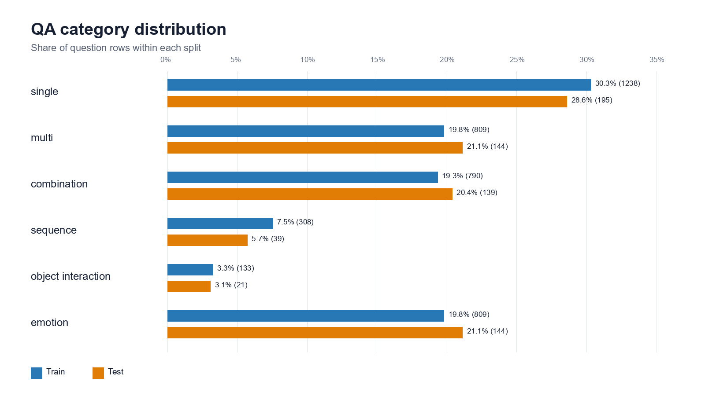
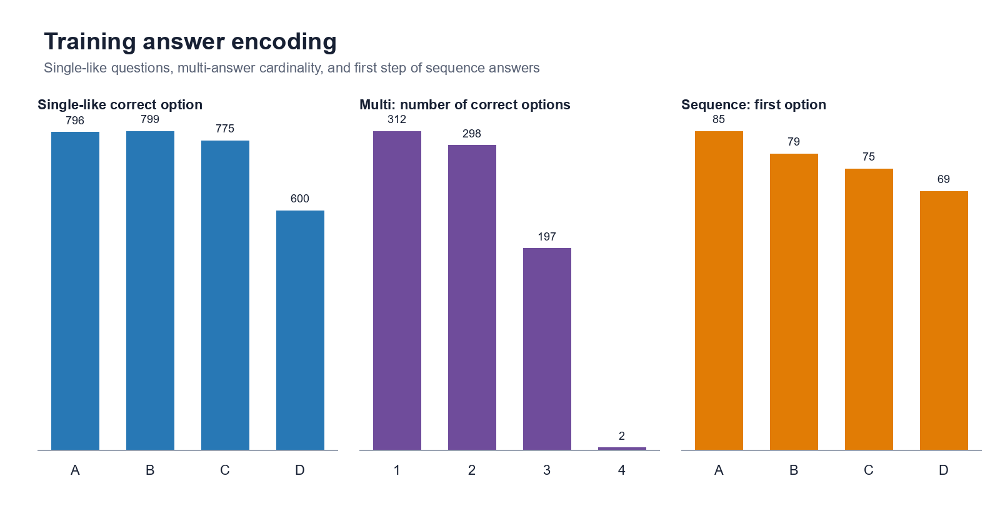
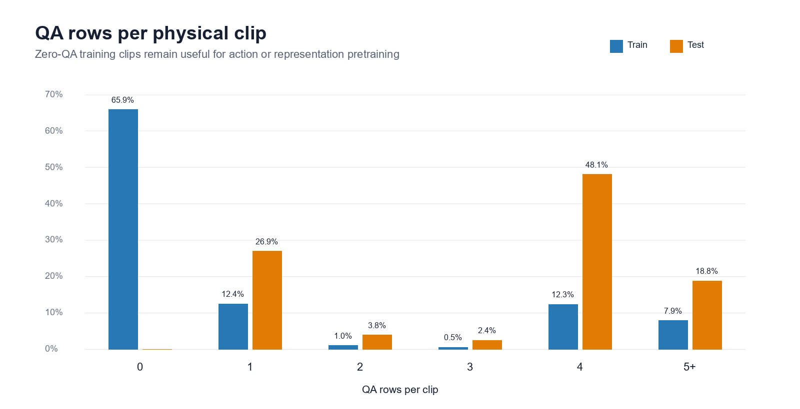
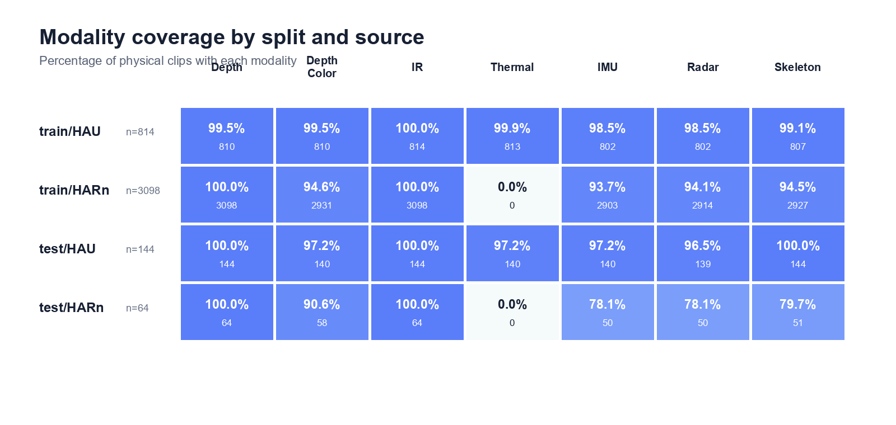

# CUHK-X EDA 与数据质量报告

> 生成时间：2026-08-19T13:28:44+00:00  
> 总体状态：**PASS WITH WARNINGS**  
> 审计范围：QA、clip manifest、全部 MP4 文件、全部传感器 CSV、每个 Skeleton unit 的一个 JSON 样本。

## 1. 执行摘要

- 数据包含 4,120 个物理 clip：训练 3,912、测试 208。
- 共 4,769 道 QA，全部成功关联到物理 clip；QA ID、必填字段和答案编码检查通过。
- 扫描 13,128 个物理 MP4：manifest 未引用 0、缺失 0、零字节 0、签名异常 0。
- 非视觉数据覆盖 3,932 个 clip；IMU、Radar 和 Skeleton 的声明目录与文件结构已核验。
- 训练集中 2,579 个 clip 没有直接 QA；它们不是坏数据，可用于 HARn 动作预训练或表征学习。
- 物理 clip 的 source 分布存在明显偏移（TVD=0.484）：训练以 HARn 为主，测试以 HAU 为主；QA source 分布则相对接近。
- 两项主要风险是：按 QA 行随机切分会造成同 clip/同用户泄漏；HARn 训练路径包含动作名称，不能作为模型输入特征。

## 2. 数据概览

| Split | Clip | QA | 有 QA 的 clip | HAU | HARn |
|---|---:|---:|---:|---:|---:|
| Train | 3,912 | 4,087 | 1,333 | 814 | 3,098 |
| Test | 208 | 682 | 208 | 144 | 64 |

## 3. QA 探索分析



### 3.1 题型分布

| Category | Train | Train % | Test | Test % |
|---|---:|---:|---:|---:|
| single | 1,238 | 30.3% | 195 | 28.6% |
| multi | 809 | 19.8% | 144 | 21.1% |
| combination | 790 | 19.3% | 139 | 20.4% |
| sequence | 308 | 7.5% | 39 | 5.7% |
| object_interaction | 133 | 3.3% | 21 | 3.1% |
| emotion | 809 | 19.8% | 144 | 21.1% |

题型分布 TVD=0.037，来源分布 TVD=0.032，均低于 0.10；宏观 train/test 组成接近。
但上述来源 TVD 按 QA 行计算；按全部物理 clip 计算为 0.484，因此建立验证集时仍必须平衡 HAU/HARn。

### 3.2 QA 完整性与模板

- 训练/测试 QA ID 重复数：0 / 0。
- 必填字段空值：训练 0，测试 0。
- 同一行内选项重复：训练 0，测试 0。
- 有效选项数：训练 {'3': 429, '4': 3658}，测试 {'3': 51, '4': 631}。其中 HARn `single` 的 D 为空是合法三选项格式。
- 数字 QA ID 序列缺口：训练 9（示例 [261, 282, 1072, 1093, 1880, 1898, 2520, 2984, 3005]），测试 0；必须保留官方 `qa_id`，不能按行号重建。
- 唯一问题模板：训练 7，测试 7；测试模板在训练中的覆盖率为 100.0%。
- Train/test 完全相同的“题型+问题+有序选项”有 5 组，涉及训练/测试 6/6 行；忽略选项顺序后有 54 组。
- 训练内部重复的“题型+问题+有序选项”共 44 组，其中 2 组在不同视频上答案不同，证明仅凭文本不能唯一确定答案。
- 选项首字母大写率按来源为 {'HARn': 0.0, 'HAU': 0.999787}；建议模型输入前统一空白和大小写，避免把排版风格当作来源捷径。
- 高模板重叠属于基准设计特征。text-only baseline 可测量答案位置和题型先验，但不能替代视频/传感器模型。

### 3.3 答案编码



- `single`、`combination`、`emotion`、`object_interaction`：答案为一个 A–D 字母。
- `multi`：1–4 个不重复字母；训练基数分布为 {'1': 312, '2': 298, '3': 197, '4': 2}。单字母答案也合法。
- `sequence`：答案是 A、B、C、D 的完整排列；训练首位分布为 {'A': 85, 'B': 79, 'C': 75, 'D': 69}。
- 非法训练答案：0；非规范顺序 multi 答案：0。

### 3.4 每个 clip 的 QA 数量



训练和验证切分必须以 clip 为最小单位；同一 clip 的多道问题不能跨 fold。

## 4. Clip、用户与动作分布

- HARn：18 个训练 subject；每人 clip 中位数 174，范围 103–210。
- HAU：18 个训练 subject；每人 clip 中位数 44，范围 33–54。
- HARn 共 44 个动作；每类 clip 中位数 56，范围 12–335。
- 没有任何 QA 引用的 HARn 动作数：0。
- Clip 最少的动作示例：Watch TV=12, Fold clothes=24, Do lunges=26, Peel fruits with a knife=29, Lie down=33；最多的动作示例：Walk=335, Eat food=154, Sit down=147, Pour drinks=131, Drink water=120。动作长尾必须纳入 grouped fold 的覆盖约束。
- HAU 与 HARn 共享 18 个用户，并共享 799 个 `(subject_id, trial_id)`；两来源必须按同一个 `subject_id` 一起分组。
- 测试集 subject 已匿名，无法证明真实测试用户与训练用户独立；因此本地 grouped validation 是泛化能力的主要可观测代理。
- HARn 路径形如 `HARn/0_Wash_face/...`，包含动作标签。该字段只允许用于分组、预训练标签和分析，不能输入最终 VQA 模型。

## 5. 模态覆盖



| Group | Clip | Depth | Depth_Color | IR | Thermal | IMU | Radar | Skeleton |
|---|---:|---:|---:|---:|---:|---:|---:|---:|
| train/HAU | 814 | 810 (99.5%) | 810 (99.5%) | 814 (100.0%) | 813 (99.9%) | 802 (98.5%) | 802 (98.5%) | 807 (99.1%) |
| train/HARn | 3,098 | 3,098 (100.0%) | 2,931 (94.6%) | 3,098 (100.0%) | 0 (0.0%) | 2,903 (93.7%) | 2,914 (94.1%) | 2,927 (94.5%) |
| test/HAU | 144 | 144 (100.0%) | 140 (97.2%) | 144 (100.0%) | 140 (97.2%) | 140 (97.2%) | 139 (96.5%) | 144 (100.0%) |
| test/HARn | 64 | 64 (100.0%) | 58 (90.6%) | 64 (100.0%) | 0 (0.0%) | 50 (78.1%) | 50 (78.1%) | 51 (79.7%) |

关键结论：

- IR 是训练和测试唯一 100% 覆盖的视觉模态；Depth 也几乎完整。
- HARn 结构上没有 Thermal，不能把它当作随机缺失；模型必须显式使用 source/modality mask。
- Depth_Color 与三类传感器均存在缺失，DataLoader 必须支持按 clip 动态回退，不能硬编码全模态交集。

## 6. 文件与格式质量

### 6.1 视频

- Manifest/物理 MP4：13,128/13,128；未引用文件 0；重复声明路径 0；逐 clip 大小不一致 0。
- 总文件大小中位数 230.0 KiB，P99 5.9 MiB。缺失：0；零字节：0；小于 1 KiB：0；MP4 `ftyp` 签名异常：0。
- 本轮对全部视频做了路径、大小和容器签名检查，但没有逐帧完整解码；首次训练前仍建议对实际选用模态执行抽样解码与时长/FPS 对齐检查。

### 6.2 IMU

- Unit：3,895；CSV：7,793；无 CSV 的 unit：0；零字节：0。
- 非规范英文文件名：84；只有 header 的 CSV：179。中文、空格、括号和通道顺序变体属于原始数据现状，加载器不能硬编码两个英文文件名。
- Header 语言分布：{'en': 15, 'zh': 7778}。加载器必须兼容中英文列名并在建模前统一 schema。
- 每个 CSV 数据行中位数 73，P01 0，P99 1043。

### 6.3 Radar

- Unit/CSV：3,905/3,905；缺失 0；非法 header 0。
- Header-only 文件：1,565。官方说明允许无检测事件，因此应编码为空点云序列，而不是删除对应 clip。
- 每文件检测行中位数 159，P99 5463。

### 6.4 Skeleton

- Unit：3,929；JSON：253,618；空 unit 0；零字节 JSON 0。
- 每 unit 帧数中位数 32，范围 1–743。
- 每个 Skeleton unit 抽取一个 JSON 做结构解析，共 3,929 个；17 keypoints/17 scores schema 失败数 0。

## 7. 数据质量门禁

| Check | Status | Severity | Observed | Expected |
|---|---|---|---|---|
| QA IDs are unique | PASS | critical | 0 | 0 duplicates |
| Required QA fields are populated | PASS | critical | 0 | 0 empty cells |
| Training answer encoding is valid by category | PASS | critical | 0 | 0 invalid rows |
| Each QA row has four distinct non-empty options | PASS | major | 0 | 0 duplicate-option rows |
| Manifest clip keys are unique | PASS | critical | 0 | 0 duplicates |
| All QA rows join to a physical clip | PASS | critical | 4769 | 4769 |
| Declared visual files exist and have MP4 signatures | PASS | critical | 0 | 0 missing/zero/signature failures |
| Declared sensor files and sampled schemas are valid | PASS | critical | 0 | 0 structural failures |
| IMU filename variants and header-only files are handled | WARN | advisory | 84 noncanonical names; 179 header-only | Schema-based loading, not exact English filenames |
| Train/test source and category mix is similar | PASS | advisory | max TVD=0.037 | TVD < 0.10 |
| Physical clip source mix is stable across train/test | WARN | advisory | TVD=0.484 | TVD < 0.10 |
| Validation must be grouped by subject across both sources | WARN | major | 18 shared users; 799 shared trial IDs | No clip/subject overlap across folds |
| HARn action names must not enter VQA model features | WARN | major | Action label embedded in training paths | Path metadata excluded from predictive inputs |
| Header-only radar files are handled explicitly | INFO | info | 1565 | Allowed by dataset documentation |
| Question-template overlap is recognized | INFO | info | 100.0% of test templates seen in train | Expected templated benchmark behavior |

## 8. 建模与验证决策

1. **Grouped split**：直接以 `subject_id` 分组，确保同一用户在 HAU 和 HARn 中的全部 clip 都进入同一 fold；同一 clip 的全部 QA 永远在同一 fold。
2. **分层约束**：在 grouped split 上尽量保持 source、题型和 HARn action 分布；保存固定 fold manifest，禁止每次实验重新随机切分。
3. **防路径泄漏**：模型输入中排除 `clip_path`、`action_id` 和 `action_name`；这些字段仅用于加载、分析和分组。
4. **类别感知解码**：single-like 输出一个字母；multi 输出去重且按 A–D 排序的非空子集；sequence 输出 A–D 的排列。
5. **模态掩码**：以 manifest 的真实可用性构造 mask；优先建立 IR/Depth 视觉基线，再加入 Skeleton、IMU、Radar 专家。
6. **无 QA clip 的利用**：2,579 个训练 clip 不进入监督 VQA loss；HARn 可用路径动作标签进行动作预训练，HAU 可做自监督表征。
7. **IMU schema 归一化**：按目录发现 CSV，再依据列名和设备名称区分上下肢；兼容中文及文件名变体，对 header-only 文件设置 empty-imu mask。
8. **Radar 空事件**：header-only 文件作为合法的零检测序列处理，并保留显式 empty-radar mask。
9. **文本先验基线**：保留 text-only/answer-prior sanity baseline，用于量化题型与答案位置偏差，但不作为最终方案。
10. **分层评估**：同时报告 question-level overall、clip-level macro、HAU/HARn、各 QA category 以及 source × category；multi 与 sequence 使用 exact match。

## 9. 范围限制与下一步

- 本报告完成了文件系统、CSV schema、MP4 容器签名和 Skeleton unit 抽样结构检查；尚未对全部视频逐帧解码。
- 下一步应生成固定的 subject-grouped folds，并在所选主模态上检查 FPS、时长、可解码帧数及跨模态时间对齐。
- EDA 摘要与检查明细分别保存于 `data/interim/eda_summary.json` 和 `data/interim/data_quality_checks.csv`。

## 10. 复现命令

```powershell
conda activate CUHK-X
python scripts/run_eda.py
```
